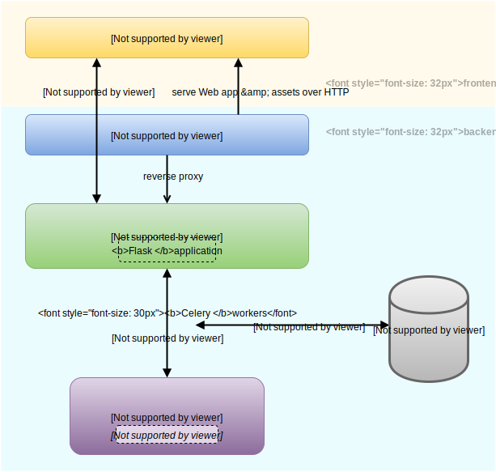

Architecture
============

Willow operates on a client-server architecture, in order to achieve separation of concern and allow for remote deployment of the backend in the future if needed. We believe that keeping remote deployment a possibility is important as some users may wish to access and manipulate their datasets online by having the Willow backend deployed on some sort of cloud infrastructure. 

Willow makes extensive use of `pandas <http://pandas.pydata.org/>`_, a Python data science library, for data representation and manipulation in the backend. **pandas** was chosen for its powerful feature set and compatibility with Seldon's machine learning pipelines. Our decision to use **pandas** had a significant impact on the design of the Willow architecture, as it imposed a requirement that we use Python-based components such as Flask and Celery in the backend. 

Overview
--------

Client
------
The Willow client is an :doc:`AngularJS web application <angular/index>` which users interact with using a Web browser. The Angular app serves solely as a frontend, communicating requests and receiving data from the backend. In order to allow for the backend to *push* results of potentially long running data operations to the Angular frontend, we decided to employ a `WebSocket API </socketAPI/index>`_ as opposed to HTTP for the communication between the backend and frontend. 

.. _architecture-server:

Server
------
The Willow backend is a multi-tier system consisting of several services and components, which are outlined here:
 
- **nginx** for serving all static assets of the Angular.js app and acting as a reverse proxy to the Gunicorn server
- **gunicorn** for serving the Flask application using eventlet workers (to support WebSocket)
- a :doc:`Flask web application <flask/index>` for establishing WebSocket connections with clients (Angular app instances) and relaying data operation requests to Celery
- **Celery** for running data operations asynchronously and concurrently inside Celery worker threads
- **redis** as a message broker and result backend for Celery
- :doc:`dcs <dcs/index>`, a Python package that serves as a façade to the pandas library, receives function calls from Celery workers
- an HDF file store for server side storage of user uploaded datasets
- **Supervisor** process control system for starting and monitoring the above services on boot and autorestarting them on crash

Sequence Diagram
----------------

The following UML sequence diagram details the process of uploading a data set and initializing a Willow session, will provide you
with an insight into how all the components of Willow work together. 

It might be a good idea to click on the image to view it zoomed in. 

.. 	figure:: _static/sequence.svg
	:width: 500px
	:alt: UML sequence diagram for dataset upload